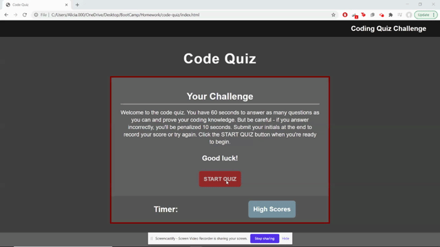

# code-quiz

## This Repository

In this project, I was tasked with building a fun and interactive coding quiz, from scratch, to practice JavaScript fundamentals and view how others are performing. With this program one can rcord their initials and score, clear scores, view high schores at any time, or play again.

Starting with 60 seconds, there are 6 questions to answer. 1 point is earned per correct answer, but incorrect answers case 10 seconds do be deducted from the timer. Once all questions are answered, or time is up, there is a page to see score earned and enter initials or a name that is stored in local storage. You can also clear scores if you want to start from scratch, or play again.

In order for people with different screen sizes to view the site, I added a mobile view CSS sheet for responsiveness.

## How To
* Read the instructions and click the "START QUIZ" button to begin.
* Answer multiple choice questions by clicking on the correct answer.
* After answering all of the questions or time is up, see score and enter initials.
* Hit the "PLAY AGAIN?" button to try again.

### Important Link and Screenshots
* [deployed site](https://breyera.github.io/code-quiz/)

### References
* [Questions used from this site](https://letsfindcourse.com/technical-questions/javascript-mcq/javascript-mcq-questions-1)